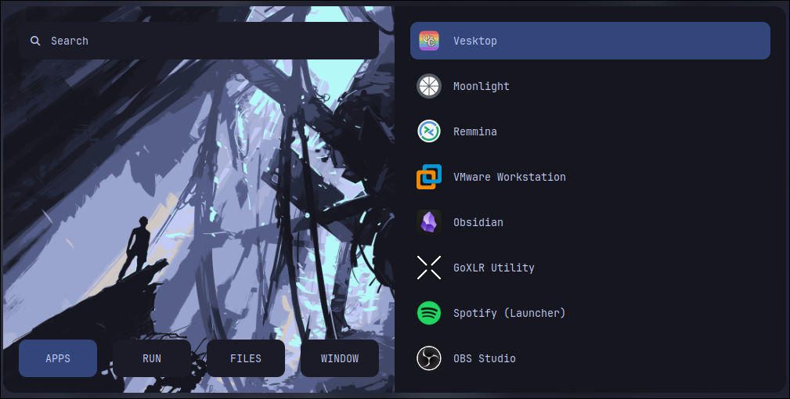
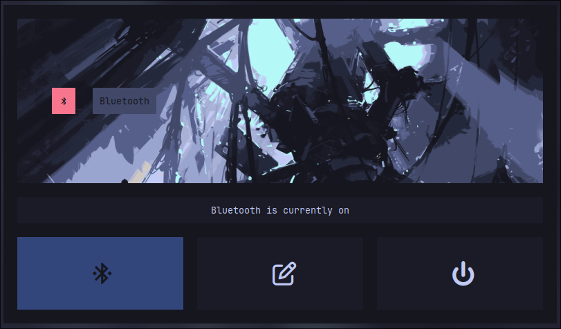
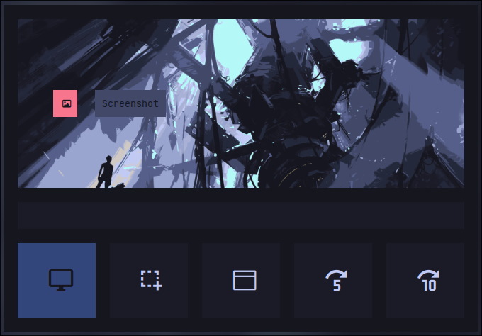
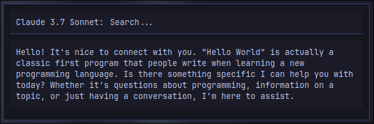

# Rofi

My rofi configs are based on the amazing work of [adi1090x](https://github.com/adi1090x/rofi). I can make things work but can't make them look pretty so this repo was a huge help!

## Launcher Types
- Application Launcher
- Screenshots
- Bluetooth Menu
- AI (Anthropic only currently)

## Future Features
- Wifi
- More AI APIs
- Wallpaper selection
- Theme selection

## Screenshots
### Application Launcher

### Bluetooth Menu

### Screenshot Menu

### AI Menu

